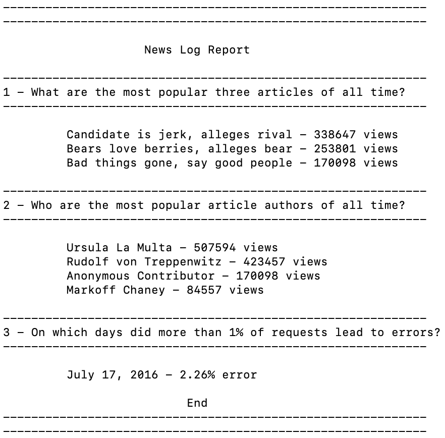

# Logs Analysis Project
## Description
This project utilizes the idea of working with data that could have come from a real-world web application, with fields representing information that a web server would record, such as HTTP status codes and URL paths. The web server and the reporting tool both connect to the same database, allowing information to flow from the web server into the report.

This shows one of the valuable roles of a database server in a real-world application: it's a point where different pieces of software (a web app and a reporting tool, for instance) can share data.

You will build an internal reporting tool that will use information from the database to discover what kind of articles the site's readers like.

The database contains newspaper articles, as well as the web server log for the site. The log has a database row for each time a reader loaded a web page. Using that information, the program will answer questions about the site's user activity.

Building an informative summary from logs is a real task that comes up very often in software engineering. For instance, at Udacity we collect logs to help us measure student progress and the success of our courses. The reporting tools we use to analyze those logs involve hundreds of lines of SQL.

The program will run from the command line. It won't take any input from the user. Instead, it will connect to that database, use SQL queries to analyze the log data, and print out the answers to some questions.

## PostgreSQL documentation
This project, will be using a PostgreSQL database. If you'd like to know a lot more about the kinds of queries that you can use in this dialect of SQL, check out the PostgreSQL documentation. It's a lot of detail, but it spells out all the many things the database can do. [link to PostgreSQL!](https://www.postgresql.org/docs/9.5/index.html)

## Getting Started
To run this program, you'll need database software (provided by a Linux virtual machine) and the data to analyze. You will also need to install python 3 on your device along with Psycopg2. Run the following commands
* `(curl -fsSL https://raw.githubusercontent.com/Homebrew/install/master/install)"`Downloads Homebrew for Mac
  * [Homebrew website](https://brew.sh)
* `brew install python3`
* `brew install psycopg2` or `sudo pip3 install psycopg2`

### The Virtual Machine
The VM is a Linux server system that runs on top of your own computer. You can share files easily between your computer and the VM; and you'll be running a web service inside the VM which you'll be able to access from your regular browser.

We're using tools called [vagrant](https://www.vagrantup.com) and [VirtualBox](https://www.virtualbox.org/wiki/Download_Old_Builds_5_1) to install and manage the VM. You'll need to install these to do some of the exercises. The instructions on this page will help you do this.

### Use a terminal
You'll be doing these exercises using a Unix-style terminal on your computer. If you are using a Mac or Linux system, your regular terminal program will do just fine. On Windows, we recommend using the Git Bash terminal that comes with the Git software. If you don't already have Git installed, download Git from [git-scm.com](https://git-scm.com/downloads).

For a refresher on using the Unix shell, look back at Udacity's [Shell Workshop](https://www.udacity.com/course/shell-workshop--ud206).

If you'd like to learn more about Git, take a look at Udacity's [course about Git](https://www.udacity.com/course/version-control-with-git--ud123).

### Install VirtualBox
VirtualBox is the software that actually runs the virtual machine. You can download it from [virtualbox.org, here](https://www.virtualbox.org/wiki/Download_Old_Builds_5_1). Install the platform package for your operating system. You do not need the extension pack or the SDK. You do not need to launch VirtualBox after installing it; Vagrant will do that.

Currently (October 2017), the supported version of VirtualBox to install is version 5.1. Newer versions do not work with the current release of Vagrant.

Ubuntu users: If you are running Ubuntu 14.04, install VirtualBox using the Ubuntu Software Center instead. Due to a reported bug, installing VirtualBox from the site may uninstall other software you need.

### Install vagrant
Vagrant is the software that configures the VM and lets you share files between your host computer and the VM's filesystem. Download it from [vagrantup.com](https://www.vagrantup.com). Install the version for your operating system.

Windows users: The Installer may ask you to grant network permissions to Vagrant or make a firewall exception. Be sure to allow this.

### Download the VM configuration
Use Github to fork and clone the repository https://github.com/udacity/fullstack-nanodegree-vm.

You will end up with a new directory containing the VM files.
Run the following commands in the terminal to get things set up:
* `cd FSND-Virtual-Machine/vagrant`
* `vagrant up`
* `vagrant ssh`
* `cd /vagrant`

The `vagrant up` command will cause Vagrant to download the Linux operating system and install it. This may take quite a while (many minutes) depending on how fast your Internet connection is.

If you are now looking at a shell prompt that starts with the word `vagrant`, congratulations — you've gotten logged into your Linux VM.

### The files for this Project
Inside the VM, change directory to `/vagrant` and look around with `ls`.

The files you see here are the same as the ones in the `vagrant` subdirectory on your computer (where you started Vagrant from). Any file you create in one will be automatically shared to the other. This means that you can edit code in your favorite text editor, and run it inside the VM.

Files in the VM's `/vagrant` directory are shared with the `vagrant` folder on your computer. But other data inside the VM is not. For instance, the PostgreSQL database itself lives only inside the VM.

Next, [download the data here](https://d17h27t6h515a5.cloudfront.net/topher/2016/August/57b5f748_newsdata/newsdata.zip) for this project. You will need to unzip this file after downloading it. The file inside is called `newsdata.sql`. Put this file into the `vagrant` directory, which is shared with your virtual machine.

To build the reporting tool, you'll need to load the site's data into your local database. Run the folloing commands:
* `cd vagrant` if you are not already in the folder in the virtual machine
* `psql -d news -f newsdata.sql`

Clone, or download, files for this project from the [Github directory, here](https://github.com/joseakamaru/Fullstack_Pojects_Udacity/tree/master/FSND-Virtual-Machine/vagrant/logAnalysisProject) into the vagrant folder, and run the following command form the command window for the virtual machine.

* `python Project_1_Log_Analysis.py`

You should receive the following output:

### Running the database
The PostgreSQL database server will automatically be started inside the VM. You can use the psql command-line tool to access it and run SQL statements

### Logging out and in
If you type `exit` (or `Ctrl-D`) at the shell prompt inside the VM, you will be logged out, and put back into your host computer's shell. To log back in, make sure you're in the same directory and type `vagrant ssh` again.

If you reboot your computer, you will need to run `vagrant up` to restart the VM.

### Created views
view_1:
`create view views_table as select title, views, author
            from articles ,(select substring(path from 10) as slug, count(*)
            as views from log where path like '%article%' and
            status like '2%' group by path) as viewtable where
            articles.slug = viewtable.slug;`

view_2:
`create view error_table as select date(time) as date,
            count(*) as error from log where status like '4%'
            group by date(time), status order by date(time);`

view_3:
`create view total_table as select date(time) as date,
            count(*) as total from log group by date(time);`
